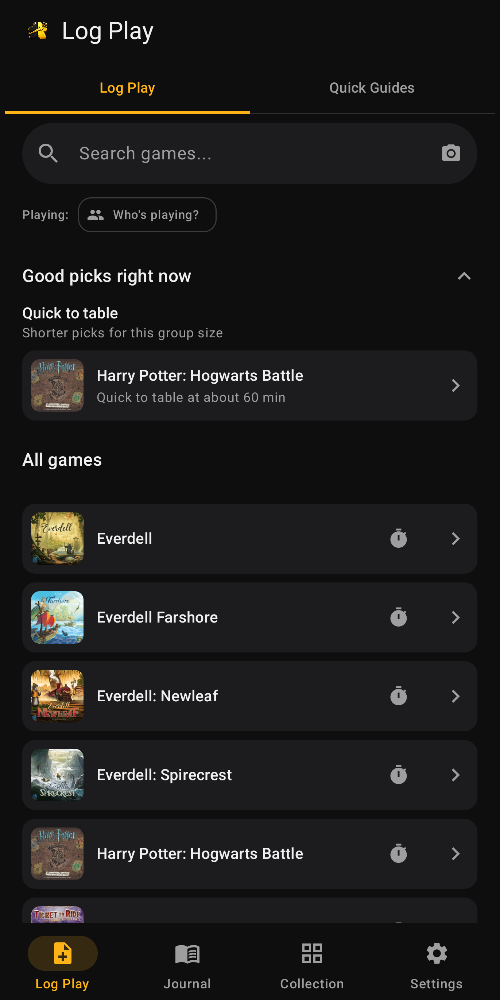
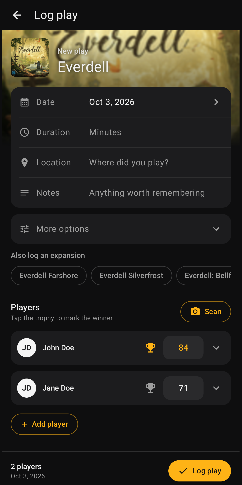
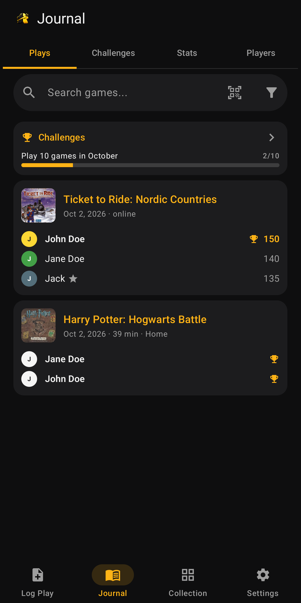
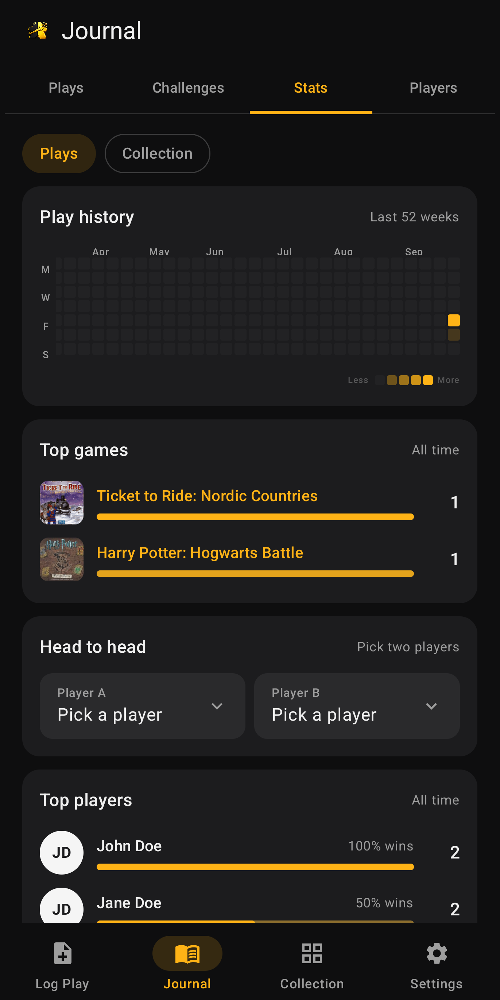
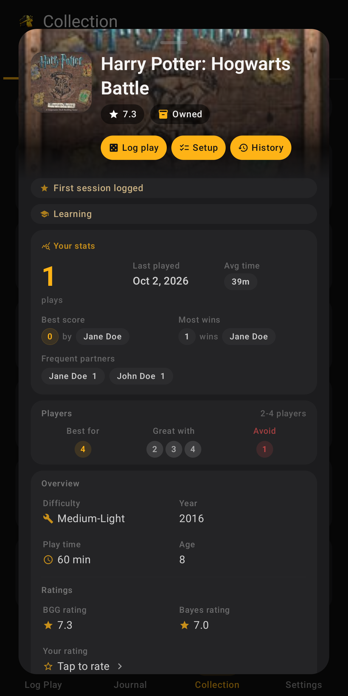

# BoardFlow

**A board game play journal for Android.** Log plays in seconds, scan score sheets with AI, follow your stats and challenges, and keep your BoardGameGeek collection at hand.

[](https://github.com/MartinAlexanderKrul/board-flow/releases/latest)


<p>
  
  
  
  
  
</p>

## Contents

- [Features](#features)
- [Getting started](#getting-started)
- [Configuration](#configuration)
- [Building, testing and releasing](#building-testing-and-releasing)
- [Architecture](#architecture)
- [Data and privacy](#data-and-privacy)
- [Documentation](#documentation)
- [Contributing setup guides](#contributing-setup-guides)

## Features

### Log Play
- Search your collection; a game you don't have is one tap away with "Search BoardGameGeek" (base games and expansions), the same in Log Play, Quick Guides, My Shelf and challenges
- Recommendations for what to play next, based on player count and history
- A grouped form for date, duration, location, notes, quantity, incomplete and "count in stats"; player rows with scores, teams and winners
- **Score sheet scanning:** a local quality check warns about dark, blurry or distant photos, then Gemini reads players, scores and the game. Recognised players and games are matched to your roster and collection, and the app learns from every confirmed scan
- **Offline first:** every play is saved on the phone first and posted to BGG in the background. Plays saved offline are posted automatically once you are online, or from the Journal outbox
- After saving: record moments (first win, new high score, win streak), challenge progress and "Try next" picks
- A play timer, a "Playing now" banner, and session continuation for game nights

### Quick Guides
- Setup cheat sheets (box, table, first turn) for each game, adjusted to player count, game mode and expansions
- A session checklist, an "Easy to forget" list, and a Start game action that starts the play timer
- Guides are open JSON in [`setup-guides/`](setup-guides/), bundled with the app and updated from GitHub without a new release. Every guide works offline
- Edit any guide in the app (rename sections, change, add, remove and reorder steps, set per-player quantities and when a step shows), share it as a file, or import one as your own version (Settings > Preferences > Quick guides); your guides are included in backups
- No guide for a game yet? Pick its rulebook PDF and Gemini drafts one, marked as a draft until you check it against the rulebook

### Journal
- **Plays:** every play with players, scores and winners; filters, search, edit, delete with Undo, and an outbox for unposted plays
- **Challenges:** personal goals (play counts, distinct games, streaks, group plays, unplayed games) with progress and deadline reminders
- **Stats:** a Plays / Collection switch. Plays covers activity heatmap, top games and players, rivalries, head-to-head and insights. Collection covers play depth, complexity and sleeve coverage
- **Players:** roster with aliases, BGG usernames and avatar colours
- **Session memory:** moods, a quote and an AI-written chronicle line for each session
- **Sharing:** a play or a whole session as a QR code, importable on another phone

### Collection
- **My Shelf:** your BGG collection with filters for owned, wishlist and played games, play status and best player count. Search for a game you don't have and add it to your BGG collection (owned, wishlist, want to play, ...) from the results
- **Game detail:** your stats, player-count advice, ratings, BGG collection status and rating editing, sleeves, and links to BGG, rules and Drive
- **Sleeves:** sleeves needed per size, owned sleeve counts, per-game exclusions and a preferred brand

### Settings
- **Sync:** accounts (BGG and Google), collection and sleeve refresh, sleeve status backup to BGG, Google Sheets sync, CSV import, Drive folders and QR codes, and a sync log
- **Preferences:** stats source, recommendations, chronicles, mood templates, sleeve brand and the setup guide
- **Scan:** Gemini key, backup keys and model, and what the app has learned from scans
- **Data:** backup and restore, and cache management

### Widgets
- Last session, daily insight, and this month's plays with the most urgent challenge. Each widget has a camera button that opens a quick scan

## Getting started

### Requirements

| Tool | Version |
| --- | --- |
| Android Studio | a current stable release |
| JDK | 17 |
| Android SDK | platform 36 (compile and target), min SDK 26 (Android 8.0) |
| Gradle | 8.14 (wrapper included) |

### Build and run

```sh
git clone https://github.com/MartinAlexanderKrul/board-flow.git
cd board-flow
./gradlew.bat :app:installDebug      # build and install on a connected device or emulator
```

On macOS or Linux use `./gradlew` instead of `./gradlew.bat`.

The app runs without any accounts: Log Play, Journal and Quick Guides work offline. Add a BGG account in **Settings > Sync** to load your collection and post plays.

## Configuration

Local build settings live in `local.properties` (not committed):

| Key | Purpose | Required |
| --- | --- | --- |
| `BGG_XML_API_TOKEN` | BoardGameGeek XML API token for searching games outside your collection. Can also be set as an environment variable | For BGG search |
| `RELEASE_STORE_FILE` | Path to the release keystore (default `release.jks` in `app/`) | Release builds |
| `RELEASE_STORE_PASSWORD`, `RELEASE_KEY_ALIAS`, `RELEASE_KEY_PASSWORD` | Release signing | Release builds |

Google sign-in (Sheets and Drive) needs external setup:

- `app/src/google-services.json` from the Firebase project
- Android OAuth clients registered with the SHA-1 fingerprints of the debug key, the release key, and Play's app signing key when distributed through Google Play
- OAuth consent screen scopes `drive.file` and `spreadsheets` (see [`SyncConfig.kt`](app/src/main/kotlin/cz/nicolsburg/boardflow/SyncConfig.kt))

User settings such as BGG credentials and the Gemini API key are entered in the app and stored in encrypted preferences.

## Building, testing and releasing

```sh
./gradlew.bat :app:compileDebugKotlin     # fast compile check
./gradlew.bat :app:testDebugUnitTest      # unit tests, including validation of every setup guide
./gradlew.bat :app:assembleDebug          # debug APK: app/build/outputs/apk/debug/
./gradlew.bat :app:assembleRelease        # signed, R8-shrunk APK: app/build/outputs/apk/release/
./gradlew.bat :app:bundleRelease          # Play Store bundle: app/build/outputs/bundle/release/
```

> **Behind an HTTPS-inspecting proxy or antivirus?** If Gradle fails with `PKIX path building failed`, add `-Djavax.net.ssl.trustStoreType=Windows-ROOT` to use the Windows certificate store.

**Releases.** Bump `versionCode` and `versionName` in [`app/build.gradle.kts`](app/build.gradle.kts), tag the commit (`vX.Y.Z`), and attach the signed APK to a GitHub release. Google Play distribution is documented in [`play-store/PLAY_RELEASE.md`](play-store/PLAY_RELEASE.md), together with the store listing, privacy policy and Data safety answers.

## Architecture

BoardFlow is a single-module Jetpack Compose app with a small manual dependency container. It uses unidirectional data flow: view models expose `StateFlow`s, and screens render them.

```text
app/src/main/kotlin/cz/nicolsburg/boardflow/
  MainActivity.kt        thin entry point: lifecycle, auth launchers, widget intents
  AppViewModel.kt        log flow, history, roster, recognition, challenges, chronicles, posting
  SyncViewModel.kt       accounts, collection and sleeve refresh, Sheets, Drive, sync log
  auth/                  Google sign-in and authorisation
  core/                  dependency container, navigation routes
  data/                  BGG, Google, Gemini clients; Room store; workers; setup guides; chronicles
  model/                 data classes and the sleeve size database
  ui/                    screens by feature, plus the shared design system in ui/common and ui/theme
```

| Concern | Where |
| --- | --- |
| Navigation and app shell | `ui/app/AppShell.kt`, `ui/app/NavTransitions.kt`, `core/navigation/AppRoutes.kt` |
| Design system | `ui/theme/` (colours, type, shapes, spacing) and `ui/common/` (`BoardFlowKit`, `BoardFlowUi`, `BoardFlowMotion`, `ScreenTabRow`) |
| Live data | Room via `data/CanonicalCollectionStore.kt` (database version 13) |
| Settings and secrets | `data/SecurePreferences.kt` (encrypted shared preferences) |
| BoardGameGeek | `data/BggApiClient.kt` (XML API, sleeves), `data/BggRepository.kt` (login, plays, collection writes) |
| Google Sheets and Drive | `data/GoogleApiClient.kt`, `auth/GoogleAuthManager.kt` |
| Gemini | `data/GeminiRepository.kt` (score extraction), `data/GeminiModels.kt` (model choice), `data/chronicle/` |
| Background work | `BggSyncWorker` (collection), `BggPlayPostWorker` (unposted plays), `ChallengeNotificationWorker` |
| Backups | `data/BackupSerializer.kt` (format version 8) |

Key design decisions:

- **Room is the source of truth** for collection, plays, players, challenges, recognition hints, sleeves and setup guides. Preferences hold settings and credentials only.
- **Source-aware merging.** BGG owns identity, stats and history. Google Sheets owns sheet-only values. Sleeve refresh owns sleeves.
- **Optimistic BGG writes.** The app shows the expected result at once and talks to BGG in the background. One shared lock (`PlayPostLock`) makes sure a play is never posted twice.
- **No hard-coded AI models.** `GeminiModels` picks the newest stable Flash model the key can use, and moves to the next one when a model is busy or retired.

Agents and contributors working on the code should start with [`AGENTS.md`](AGENTS.md): it maps every flow, the UI conventions and the gotchas.

## Data and privacy

BoardFlow has no server, ads or analytics. Data stays on the device and in the accounts the user connects: BoardGameGeek, optionally Google Sheets and Drive (only files the app creates, plus the connected sheet), and optionally the Gemini API with the user's own key. See the [privacy policy](play-store/privacy-policy.md).

## Documentation

| Document | Contents |
| --- | --- |
| [`AGENTS.md`](AGENTS.md) | Architecture, flows, conventions and gotchas: the reference for code changes |
| [`docs/UI_SURFACES.md`](docs/UI_SURFACES.md) | Every screen, dialog and sheet, and the shared components behind them |
| [`docs/GAMIFICATION.md`](docs/GAMIFICATION.md) | Insights, record moments, mastery, challenges, chronicles and recommendations |
| [`docs/WIDGETS.md`](docs/WIDGETS.md) | Home screen widgets |
| [`docs/LOGGING.md`](docs/LOGGING.md) | Logcat tags and filters for debugging |
| [`setup-guides/README.md`](setup-guides/README.md) | Quick Setup guide format and writing rules |
| [`play-store/`](play-store/) | Google Play listing, privacy policy, Data safety and release checklist |

## Contributing setup guides

Quick Setup guides are plain JSON files, one per game. To add or fix one, follow [`setup-guides/README.md`](setup-guides/README.md), run `./gradlew.bat :app:testDebugUnitTest` to validate it, and open a pull request. Merged guides reach every install through the remote catalog.

---

BoardFlow is an independent project and is not affiliated with or endorsed by BoardGameGeek.
